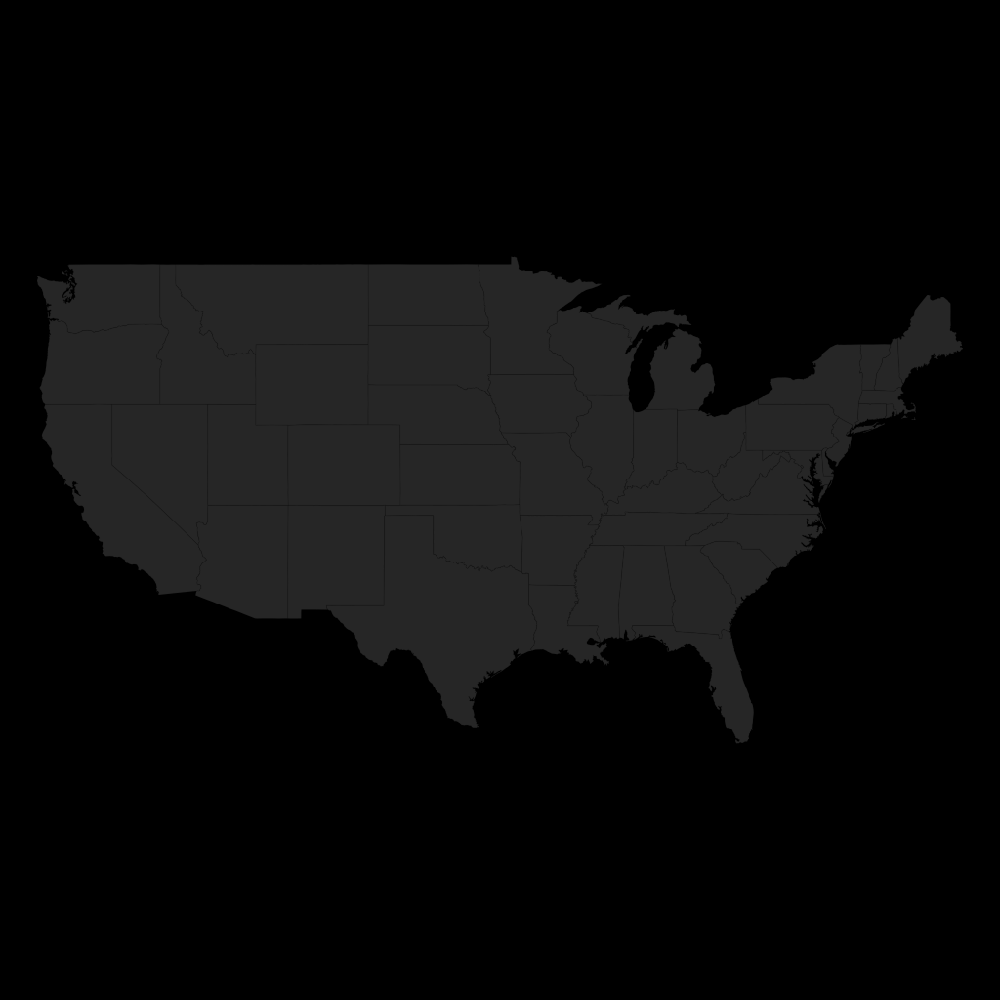

```{r, include=FALSE}

source('./lib/utils.R')

```

# 1. Introduction:

In this report, we focus on the Airline On-time Performance dataset from the Bureau of
Transportation Statistics in the U.S.

After explaining the data collection process, we are going to through several data exploration
step in order to better understand airline traffic and causes of delays. From that knowledge
and/or the hypotheses we make, we are going to build a set of features that we help
better describe the mechanisms underlying flights delay.

Finally, by noticing that On-time performance over the network can be highly affected by
On-time performances of highly connected airports, we will conduct a simple predictive
analysis in order to predict arrival delays at the Chicago airport.

# 2. Data collection and preparation:

First we are going to describe the process of collecting and preparing the different
data sets required for the report.

The data was stored in PostgreSQL database. Considering the size of the data set, I am aware this might not be the best fit for such analysis but that was the most straight forward way
of getting started. I created a `t2.large` instance and to be able to improve my workflow
I built an index on the `flights` table using `index.sql`.

I used that [https://github.com/Antobiotics/docker-utils](repository) which is
a tiny command line tool (not finished at all) that I use when i quickly need to setup services for prototyping.

To bootstrap the servers:

```
> swarm_queen bootstrap --instances all
> docker-compose -f services.yml up -d
```

Update `./utils.R` with `public.dns` by running:

```{}
> swarm_queen describe --instance swarm_master
```


To kill them:

```
> swarm_queen takedown --instances all
```

## a. On-Time Performance data:

The purpose of this document is mainly exploratory, and at the time of the data collection. It wasn't yet what will be researching. So the choice has been made to use as much data as 
possible.

It was first collected with the data 1997 to 2016 using the `1_prepare_flights.R`
script which simply downloads the data from the Bureau of Transportation Statistics servers.

Unfortunately some manual steps were required for the year 2016.
After some `NULL` artifacts were removed from the different data sets,
a PostgreSQL table was created. 

## b. Weather data:

Weather data was collected using the `weatherData` package that queries [https://www.wunderground.com/](WeatherUnderground)'s API. To collect the data locally,
one would need to run the `weather_data.R` script. It takes a long time to run,
so we only focused on the year 2013 when using that data set.

Later on, I realized that historical weather data were publicly available
on an FTP server. Thus I wrote `2_prepare_weather.R` that fetches, aggregates,
transforms and loads the data to the PostgreSQL instance in a table called
`weather_2013`.

__PS__: Those scripts were sort of built on the fly. So not entirely tested.
I would advice to step through them instead of directly running them as `Rscript`'s.

## c. IATA/ICOA Aiport Codes:

Different location identifiers are used to describe airports, aircraft, airlines
but alose weather stations. On-time Performance data set uses IATA and the
weather data we collected uses WMO codes, other data set uses ICAO.
Therefore we need to build a look-up table.
We downloaded it from [http://openflights.org/data.html](openFlights)

Using `3_prepare_code_lookups.R` one can then build a table `airports` containing
airports data joined with their corresponding weather stations data.

## d. Inventory data:

By browsing the collection of data sets available in the
[http://www.transtats.bts.gov/](Bureau of Transportation Statistics), I realised
data was available about the aircrafts them selves. In the context of exploratory
data analysis, I thought it might be interesting to investigate questions like:
"Do aging planes correlate with higher delays?"

The data set being quite small, I manually downloaded it and copied it into a table
`inventory`. Run: `5_prepare_inventory.R`

## e. Carriers data:

Contains simple descriptive data about the carriers. Run: `4_prepare_carriers.R`

# 3. Data Exploration:

In this section, we are going to get our hands on the data.
This will help us to make assumptions on the data, and give a rational for later
feature engineering.

We are going to look at aggregated counts on the number of flights, this will give us
an idea of the evolution of the system in time and on its seasonal constraints.

Then we are going to look at the delays data, how it evolves and the factors affecting it.

Finally, traffic data can always be studied as a network. We are going to look at
a few network-based metrics and see how we could potentially use them.

In fact, transportation can be seen as queuing process at the airport level, airports
being connected we can hypthetise that delays at the origin airport will have a
a strong impact on the delays at the arrival airport. Therefore, it is seems natural
to think that delays propagate over the network.
One might also want to have a look at how delays on the top ranking nodes affect
delays on the whole system.

## 3.a Analysis of the number of flights
First let's have a look at the number of flights per day. Does the number of flights follow seasonal patterns?

How does the number of flights evolved over time? What is the trend? Are there any seasonal patterns we can derive from it?


```{r}
  flights.daily <-
    dbGetQuery(connection,
                "SELECT flight_date, COUNT(*) AS num_flights
                 FROM flights
                 GROUP BY flight_date
                ") %>%
    dplyr::mutate(flight_date = as.Date(flight_date))

  flights.daily.ts.df <-
    flights.daily %>%
    dplyr::mutate(
      year        = format(flight_date, "%Y"),
      day         = wday(flight_date),
      month       = month(flight_date),
      common_date = as.Date(
        paste0("2000-",format(flight_date, "%j")), "%Y-%j")
    )

   ggplot(flights.daily.ts.df, aes(x = common_date, y = num_flights)) +
    geom_line(aes(group = 1, color = year)) +
    facet_grid(facets = year ~ ., scales = "free_x") +
    scale_x_date(labels = function(x) format(x, "%d-%b")) +
    theme_bw()
   
```


```{r, include=FALSE}

  flights.weekday <-
    flights.daily.ts.df %>%
    dplyr::mutate(tot_flights = sum(num_flights)) %>%
    dplyr::group_by(day) %>%
    dplyr::summarise(
      flights_on_day = sum(num_flights) / max(tot_flights)
    )  

  p.weekday <-
    ggplot(flights.weekday) +
      geom_bar(aes(x = day, y = flights_on_day), stat = "identity")

```

```{r, include=FALSE}

  flights.daily.ts.df$is_holiday <-
    isHoliday(timeDate(flights.daily.ts.df$flight_date))

  p.holiday <-
    ggplot(
      flights.daily.ts.df %>%
      dplyr::mutate(tot_flights = sum(num_flights)) %>%
      dplyr::group_by(is_holiday) %>%
      dplyr::summarise(
        flights_on_holiday = sum(num_flights) / max(tot_flights)
        )
      ) +
      geom_bar(aes(x = is_holiday, y = flights_on_holiday), stat = "identity")
  
```


```{r, include=FALSE}

  flights.daily.ts.df$season <-
    GetSeason(flights.daily.ts.df$flight_date)

  p.seasons <- 
    ggplot(
      flights.daily.ts.df %>%
      dplyr::mutate(tot_flights = sum(num_flights)) %>%
      dplyr::group_by(season) %>%
      dplyr::summarise(
        flights_for_season = sum(num_flights) / max(tot_flights)
        )
      ) +
      geom_bar(aes(x = season, y = flights_for_season), stat = "identity")

```

```{r, include=FALSE}

hourly.flights.query <-
  "SELECT
      crs_dep_hour
    , count(*) as num_flights
   FROM (
    SELECT
        flight_num
      , (crs_dep_time/100)::int AS crs_dep_hour
    FROM flights
    ) AS trunc
    GROUP BY crs_dep_hour"

flights.hourly <-
  dbGetQuery(connection, hourly.flights.query)

  p.hours <-
    ggplot(
      flights.hourly %>%
      dplyr::mutate(tot_flights = sum(num_flights)) %>%
      dplyr::group_by(crs_dep_hour) %>%
      dplyr::summarise(
        flights_at_hour = sum(num_flights) / max(tot_flights)
        )
      ) +
      geom_bar(aes(x = crs_dep_hour, y = flights_at_hour), stat = "identity")
  
```


```{r}

  grid.arrange(p.weekday, p.holiday,
               p.seasons, p.hours, ncol = 2)

```

From this charts we can hypothesize, the existence of several seasonal regimes in the time series.
 * A weekly component.
 * Winter/Summer.
 * Bank holidays.

Validating the hypothesis that the number of daily flights is strongly seasonal is out of 
the scope of this report.

There are many different approaches that could be used to validate
such hypothesis (GLMs + ANOVA, chitest, tbats) but we would usually suggest the following
approach:
Fit multiple ARIMA models by incrementally adding `day_of_week`, `is_holliday`, `season` as
exogenous regressors and observe if a reduction of the `AIC` occur.


## 3.b Analysis of flight delays.

When exploring Airline traffic On-Time Performance data one key variable to analyse
is obviously the departures/arrivals delays.

Sources of airport delays are various and can propagate over the system.

The main sources of delays are the following:

  __Air Carrier:__ The cause of the cancellation or delay was due to circumstances within the airline's control (e.g. maintenance or crew problems, aircraft cleaning, baggage loading, fueling, etc.).
  __Extreme Weather:__ Significant meteorological conditions (actual or forecasted) that, in the judgment of the carrier, delays or prevents the operation of a flight such as tornado, blizzard or hurricane.
  __National Aviation System:__ Delays and cancellations attributable to the national aviation system that refer to a broad set of conditions, such as non-extreme weather conditions, airport operations, heavy traffic volume, and air traffic control.
Late-arriving aircraft: A previous flight with same aircraft arrived late, causing the present flight to depart late.
  __Security:__ Delays or cancellations caused by evacuation of a terminal or concourse, re-boarding of aircraft because of security breach, inoperative screening equipment and/or long lines in excess of 29 minutes at screening areas.
  
More than affecting a single flight, they also cause an excess in flow imbalance. Meaning that when the departure and arrival rates can exceed the airport capacity. The chain of events required to put an aircraft in operation is then perturbed and thus we might
observe an accumulation of delays at both the airport level and at the network level.

First let's gather the data and remove flight diversions columns that we are not going
to study here. We also join the weather, aircrafts, airports and carriers dataset. See:
`./lib/sql/main_data.sql`. It is a very slow query even with an index, please make sure to
have one.

__Note__: This query build some of the metrics mentioned in `3.c` too.

Then we are going to going add a few columns to represent seasonal effects such as day of the week, month name, flags to indicate if the flight occrured during
an holiday, and the current season.  We then remove all `NA`'s from the dataset.

```{r}

  query <-
    paste(readLines("./lib/sql/main_data.sql"), collapse = " ")

  flights.data <-
    dbGetQuery(connection, query)

  flights.data <-
    flights.data %>%
    dplyr::filter(!is.na(arr_delay) & !is.na(dep_delay) & !is.na(distance)) %>%
    dplyr::mutate(
      day           = wday(flight_date),
      month         = month(flight_date),
      is_holiday    = isHoliday(timeDate(flight_date)),
      season        = GetSeason(flight_date),
      crs_dep_hour = as.integer(crs_dep_time / 100),
      crs_arr_hour = as.integer(crs_arr_time / 100),
      aircraft_age = 2013 - manufacture_year,
      acquired_for = 2013 - as.numeric(format(as.Date(acquisition_date), '%Y')),
      weather_delay_type       = ifelse(weather_delay > 0, "Weather Delay", ""),
      carrier_delay_type       = ifelse(carrier_delay > 0, "Carrier Delay", ""),
      nas_delay_type           = ifelse(nas_delay > 0, "NAS Delay", ""),
      late_aircraft_delay_type = ifelse(late_aircraft_delay > 0, "Late Aircraft", ""),
      security_delay_type      = ifelse(security_delay > 0, "Security Delay", "")
  ) 
   
```


### 3.a.1 The distribution of Departure/Arrival delays:

Let's look at the distributions of departure and arrival delays. In fact, we would like to
first see if there is any major difference between their distributions among flights.
It is important to keep in mind that a flight is considered delayed when it arrived 15 or more minutes than the schedule.

```{r}

  ggplot(flights.data) +
    geom_hex(aes(x = dep_delay, y = arr_delay)) +
    geom_vline(xintercept = 15) +
    geom_hline(yintercept = 15)

```

It is often useful to look at both the cummulative distribution function too.

```{r}

ggplot() +
  stat_ecdf(
    data = flights.data %>%
    dplyr::filter(arr_delay <= 240 & arr_delay >= -60), aes(arr_delay, color = "Arrival")) +
  stat_ecdf(
    data = flights.data %>%
    dplyr::filter(dep_delay <= 240 & dep_delay >= -60), aes(dep_delay, color = "Departure")
  ) + geom_vline(xintercept = 15)

```

We note that the delays distributions are highly skewed with a significant amount
of outliers. The distribution of arrival delays is wider than the distribution of
departure delays. Delays are slightly centered just below zero, so most of the flights
leave and arrive before the scheduled time. Around 77% of the flights can not be considered
delayed.

```{r}

    ggplot(
      flights.data %>%
      dplyr::group_by(distance_group) %>%
      SummarizeDelay() %>%
      dplyr::select_(.dots = c("distance_group", "frac_dep_delayed", "frac_arr_delayed")) %>%
      melt(id.vars = 1),
    aes_string(x = "distance_group", y = "value")
    ) +
    geom_bar(aes(fill = variable), stat = 'identity', position = 'dodge')


```

For high distance groups (9+), a higher ratio of flights are delayed at arrival. This suggest that arrival delays are more likely to occur for longer flights and that they might
due to on-air effects or congested arrival airports. 

### 3.a.1 Time effects on the proportion of delayed flights:

We saw earlier that flights traffic is highly seasonal and is composed of several
seasonal components. How does that affect delays on the network?

Let's at how time factors affect the fraction of delayed flights.
```{r}
  PlotDelayTimeOverview(flights.data, "frac_arr_delayed", "frac_dep_delayed")
```

For both departures and arrivals, the impact of the month of December is clear. September, October and November are the months with the least amount of delay. Spring and Summer are marked by higher delays which can be explained by more planes in circulation and more holidays. But surprisingly, grouping by holiday days doesn't show the same effect.

For the hourly data, we notice that the fraction of delayed planes is a its lowest in
early morining hours and that delays accumulate from the morning to the night. We
suspect this effect to come from the propagation of delays on the network all along the
day. If a flight is delayed, the next flight has to wait for its arrival before it can
start operate.

But what is surprising is that despite an high amount of flights delayed in December, the overall fraction of delays in Winter is still lower than Spring and Summer. Could it be that a few airports are more subject to weather effects than others? When it was a well known
that the main causes of delays in the 2000's were Weather effects, is it still true in the
2010's?


### 3.a.1 Causes of delays:
Let's look at the causes for delays and how it compares between airports and carriers.

```{r}

delay.causes.df <-
  flights.data %>%
  dplyr::filter(dep_del15 != 0 | arr_del15 != 0) %>%
  na.omit()


delay.causes.wide <-
  delay.causes.df %>%
  dplyr::select(flight_num, carrier, origin, dest, tail_num,
                weather_delay_type, carrier_delay_type,
                nas_delay_type, late_aircraft_delay_type,
                security_delay_type)


```

```{r}

  selects <- c("flight_num", "weather_delay_type",
               "carrier_delay_type", "security_delay_type",
               "nas_delay_type", "late_aircraft_delay_type",
               "security_delay_type")

  ggplot() +
  geom_bar(
    data = 
      delay.causes.df %>%
      dplyr::select_(.dots = selects) %>%
      melt(id.vars = c("flight_num")) %>%
      dplyr::filter(value != "") %>%
      dplyr::select(flight_num, value) %>%
      dplyr::mutate(
        tot_flights = n()
      ) %>%
      dplyr::group_by(value) %>%
      dplyr::summarise(
        percent_flights = n() / max(tot_flights)
    ),
  aes(x = reorder(value, percent_flights), y = percent_flights),
      stat = 'identity'
  )
  

```

In contrary to what was true before 2010's weather delays and security delays are way less frequent than the other causes. See: [https://www.bloomberg.com/news/articles/2016-08-23/blame-the-airlines-not-the-weather-for-most-u-s-flight-delays](article from Bloomberg)

```{r}

  selects <- c("flight_num", "carrier", "weather_delay_type",
               "carrier_delay_type", "security_delay_type",
               "nas_delay_type", "late_aircraft_delay_type",
               "security_delay_type")
  ggplot() +
  geom_bar(
    data = 
      delay.causes.df %>%
      dplyr::select_(.dots = selects) %>%
      melt(id.vars = c("flight_num", "carrier")) %>%
      dplyr::filter(value != "") %>%
      dplyr::select(flight_num, value, carrier) %>%
      dplyr::mutate(
        tot_flights = n()
      ) %>%
      dplyr::group_by(value, carrier) %>%
      dplyr::summarise(
        percent_flights = n() / max(tot_flights)
    ),
  aes(x = reorder(carrier, percent_flights), y = percent_flights, fill = value),
      stat = 'identity', position = 'dodge'
  )
  

```

Some carriers seems to have more Late Aircraft than others. 

```{r}

  top.origins <-
    flights.data %>%
    dplyr::group_by(origin) %>%
    dplyr::summarise(
      num_flights = n()
    ) %>% top_n(15, num_flights)

  delay.causes.top.airports <-
      delay.causes.wide %>%
      dplyr::select(-carrier, -dest, -tail_num) %>%
      melt(id.vars = c("flight_num", "origin")) %>%
      dplyr::filter(value != "") %>%
      dplyr::right_join(top.origins, by = 'origin')  %>%
      dplyr::select(flight_num, value, origin) %>%
      dplyr::group_by(origin) %>%
      dplyr::mutate(
        origin_num_flights = n()
      ) %>%
      dplyr::ungroup() %>%
      dplyr::mutate(
        tot_flights = n()
      ) %>% 
      dplyr::group_by(value, origin) %>%
      dplyr::summarise(
        percent_flights = n() / max(origin_num_flights)
     ) %>% arrange(-percent_flights)
  
  ggplot() +
  geom_bar(
    data = delay.causes.top.airports,
  aes(x = reorder(origin, percent_flights), y = percent_flights, fill = value),
      stat = 'identity', position = 'dodge')  + coord_flip()
  

```

depends on aiport ....

The traffic demand in the evening decreased, at the same time the capacity decreased. 


## 3.c Building metrics and delay propagation:

At this stage, we are ready to build several flights and airport centric metrics.
Keys Variables:

  * __Flight arrival delay (deltaT AT):__ Arrival delay equals the difference of the actual
  arrival time minus the scheduled arrival time.
  
  * __Airport capacity:__ It is the ability of the airport to support the chain of events
  require to go from the origin to the destination airport. We ideally want to look at
  the maximum number of planes that can be handled during a certain amount of time. 
  As a first approximation, it can be computed as the number of (arrivals + departure) per 
  hour. Since the arrivals/departure rates depend on external factors
  the capacity of an airport encapsulate those external factors too.
  
  * __Arrival demand:__ It can be seen as the pressure put to the queuing system that
  represents an airport. It can be seen as the total number of completed arrivals per hour
  divided by the number of scheduled arrivals.

  * __Time between arrivals:__ Some sources of delay (such as strong winds) are known to have a   different kind of impact on delays than other (low clouds for example).
  When the system runs smoothly, we can assume that the rate of arrivals is constant, whereas
  under unfavorable conditions the rate of arrivals will change over time.

  * __Weather conditions:__ Precipitations/Wind Speed and others measure we get from the
  weather data set.

  * __Seasonal effects:__ We saw (through our first exploration) of the data set
  that airline traffic is strongly seasonal. We can then hypothesize such effects will
  have a significant impact on the delays, even if seasonal components on are less
  defined for the average daily delays.

  * __Aircraft age:__ We saw that there is slight relationship between the age of a plane and
delays.

  * __Top Ranking congested hub:__ Underlies propagation of delays over the network.

  * __Congestion:__ We want to have a metric of congestion over the full network.
  To do so, the average delay of all delayed flights during the year is taken as baseline.
  An airport is considered as congested whenever the average delay of all its departing flights
  over a certain period of time exceeds that baseline.

We could have derived more interesting metrics, especially aroung queuing theory and
network analysis, but I realise I have waisted already too much time experimenting different
techniques during the analysis and especially with things that I wont show... Also I wont spend
too much time exploring how those metrics interact together.

First we need some basic informations about the airports:
```{r}

airports <-
  dbGetQuery(connection,
             "SELECT iata, city, latitude, longitude
             FROM airports")

```


Then we need flights data, we will only consider the 9th of December for now,
since it was the most congested day in December.

```{r}

flights <-
  dbGetQuery(connection,
             "SELECT
               flight_num
             , origin as source
             , dest as target
             , latitude
             , longitude
             , (crs_arr_time / 100)::int as crs_arr_hour
             , (crs_dep_time / 100)::int as crs_dep_hour
             , (dep_time / 100)::int as dep_hour
             , (arr_time / 100)::int as arr_hour
             , arr_delay_minutes as arr_delay
             , dep_delay_minutes as dep_delay
             , weather_delay
             , carrier_delay
             , nas_delay
             , late_aircraft_delay
             , security_delay
             FROM flights
             LEFT JOIN (
             SELECT iata, latitude, longitude
             FROM airports
             ) AS airports
             ON airports.iata = flights.origin
             WHERE flight_date = '2013-12-09'
             ") %>% na.omit() %>%
  dplyr::mutate(
    weather_delay_type       = ifelse(weather_delay > 0, "Weather Delay", ""),
    carrier_delay_type       = ifelse(carrier_delay > 0, "Carrier Delay", ""),
    nas_delay_type           = ifelse(nas_delay > 0, "NAS Delay", ""),
    late_aircraft_delay_type = ifelse(late_aircraft_delay > 0, "Late Aircraft", ""),
    security_delay_type      = ifelse(security_delay > 0, "Security Delay", "")
  )

```

Now, for each airport we want to build a schedule dateset that contains information
about the aiports traffic per hour, such as: (see: `./lib/schedule.R`)

 * Arrivals/Departures etc...
 * Demand
 * Lag
 * Capacity/Scheduled Capacity
 * Runway Pressure
 * Total Cumulative Delay
 * Flow

```{r}

source('./lib/schedule.R')

airports.schedule <-
  BuildSchedule(flights.df = flights,
                airports = airports,
                dep = "source",
                arr = "target",
                dep_features = c("crs_dep_hour"),
                arr_features = c("crs_arr_hour"),
                sched_dep_features = c("dep_hour"),
                sched_arr_features = c("arr_hour"),
                col.names = c("hour")
)

```

It would have been very interesting to do an in depth network analysis to better understand
delay propagation on the network. Instead, I propose an animated visualisation of the
Total Cumulative Delay on the network.

```{r}
source('./lib/network_animation.R')
BuildFlightNetworkAnimation(flights,
                            airports.schedule,
                            "cum_tot_delay_sc")
```

(Not sure if I can show the GIF in here. Please look at the `./output` directory)



We can see in this animation how the network becomes congested. Two hubs (Chicago and Atlanta)
become congested first and spread delay to smaller smaller airports.
It's thus really important that the traffic goes smoothly on the aiports with the highests degrees of connectivity. But is there a relationship between the degree of connectivity of an aiport the types of delays?

```{r}

flights.aug <-
  flights %>%
  dplyr::left_join(airports.schedule,
                   by = c("crs_dep_hour" = "hour", "source" = "hour")) %>%
  dplyr::group_by(source) %>%
  dplyr::mutate(
    num_targets = n_distinct(target)
  ) %>%
  dplyr::ungroup() %>%
  dplyr::select_(.dots = c("flight_num", "late_aircraft_delay_type", "weather_delay_type",
                           "nas_delay_type", "security_delay_type", "carrier_delay_type",
                           "cum_tot_delay")
  ) %>%
  melt(id.vars = c("flight_num", "cum_tot_delay")) %>%
  dplyr::filter(value != "") %>%
  dplyr::mutate(
    num_targets_cut = cut(cum_tot_delay,  breaks = c(0, 25, 50, 75, 100, Inf))
  ) %>%
  dplyr::select(flight_num, value, num_targets_cut) %>%
  dplyr::mutate(
    tot_flights = n()
  ) %>%
  dplyr::group_by(value, num_targets_cut) %>%
  dplyr::summarise(
     percent_flights = n()
  )

ggplot(flights.aug) +
  geom_bar(aes(x = num_targets_cut, y = percent_flights, fill = value),
           stat = 'identity', position = 'fill'
  ) + scale_y_continuous(labels = percent_format())
  

```

If, indeed, the Cumulative Total Delays grows with the degree of an airport, it important to note that the proportions for each causes of delays don't chage significally.

# 4. Predictive analysis:

This section helped us to understand that if one wants to optimise On-time performance,
one would need to particulary focus on the performances of the airports with high degree of
connectivity. Thus, we propose here to use the data set to predict Arrival delays in Chicago (ORD).

```{r}
rm(flights)
rm(delay.causes.df)
rm(delay.causes.wide)
```

First let's take the features we want and focus on flights connecting with ORD.

```{r}

p.flights.data <-
  flights.data %>%
  dplyr::filter(origin == 'ORD' | dest == 'ORD') %>%
  dplyr::filter(month == 12) %>%
  dplyr::mutate(
    dep_hour = as.integer(dep_time / 100),
    arr_hour = as.integer(arr_time / 100),
    day_num = as.integer(format(as.Date(flight_date), "%d"))
  ) %>%
  dplyr::select(year, month, day_of_week, carrier, crs_dep_time,
                crs_arr_time, crs_elapsed_time,
                distance_group, number_of_seats, manufacture_year,
                temp, visib, fog, rain_drizzle, snow_ice_pellets,
                hail, thunder, tornado_funnel_cloud, day, day_num,
                is_holiday, season, crs_dep_hour, crs_arr_hour,
                acquired_for, aircraft_age,
                origin, dest,
                dep_hour, arr_hour, dep_delay, arr_delay)

```

Now let's try to build a schedule.

```{r}

source('./lib/schedule.R')
p.airports.schedule <-
  BuildSchedule(flights.df = p.flights.data,
                airports = airports,
                dep = "origin",
                arr = "dest",
                dep_features = c("month", "day_num", "crs_dep_hour"),
                arr_features = c("month", "day_num", "crs_arr_hour"),
                sched_dep_features = c("month", "day_num", "dep_hour"),
                sched_arr_features = c("month", "day_num", "arr_hour"),
                col.names = c("month", "day_num", "hour")
)

p.ord.schedule <-
  p.airports.schedule %>%
  dplyr::filter(iata == 'ORD')

```

Now we can join the Airport's schedule back to `p.flights.data`

```{r}
# Couldn't figure out how to do a conditional join in a straight forward way
# I should have done that for the animation too, that was the missing piece to
# better expose the propagation of delays, a.k.a getting the schedule at arrival
# data at the arrival node.

p.flights.data.with.schedule <-
  rbindlist(
    lapply(X = 1:nrow(p.flights.data), FUN = function(i) {
      row <- p.flights.data[i, ]
      f.hour <- row$dep_hour
      if (row$dest == 'ORD') {
        hour <- row$arr_hour
      }
      
      schedule.subset <-
        p.ord.schedule %>%
        dplyr::filter(month == row$month
                      & day_num == row$day_num
                      & hour == f.hour)
      schedule.subset <-
        schedule.subset[1, ] %>%
        dplyr::select(-iata, -month, -hour, -day_num)
      return(cbind(row, schedule.subset))
    })
  )
 
p.flights.data.with.schedule <-
  p.flights.data.with.schedule %>%
  dplyr::select( -origin, -dest, -city, -latitude,
                -longitude, -cum_tot_delay_sc, -demand_sc,
                -lag_sc, -runway_pressure_sc)
  
```

We remove `NA`'s and build dummies

```{r}

p.flights.data.with.schedule <-
  p.flights.data.with.schedule %>%
  na.omit()

carriers <- p.flights.data.with.schedule$carrier
carriers.dummies <- model.matrix(~carriers)[, -1]

is.holiday <- p.flights.data.with.schedule$is_holiday
hol.dummies <- model.matrix(~is.holiday)[, -1]

seasons <- p.flights.data.with.schedule$season
seasons.dummies <- model.matrix(~seasons)[, -1]

p.flights.data.with.schedule.dum <-
  p.flights.data.with.schedule %>%
  dplyr::select(-is_holiday, -season, -carrier, -dep_delay) %>%
  cbind(carriers.dummies, hol.dummies, seasons.dummies)

```

Let's build a model now. We would have liked to build a baseline first too.
Because, with the current setup it takes a lot of time build a random forest model.
We wont make the full one available here. 

Ensemble models are often considered as black-box models, but we will see that building
such models can help us highlight pattern we've missed during the initial data exploration.
We will look at two models, one for the month of July and one for the month of December,
those two months were more congested than normal and it will be interesting to compare
its performances in both cases.

TODO:

  - Compare with October (month with the least delays).
  - Show results when Schedule related features are removed.

Finally by removing, schedule related features, we will validate the idea that higher level
metrics can significantly improve the predictions and the understanding of On-time performance.

```{r}

set.seed(13) 
training.index <- createDataPartition(p.flights.data.with.schedule.dum$arr_delay,
                                      p = 0.75, list = FALSE)[ ,1]

train.data <- p.flights.data.with.schedule.dum[training.index,] 
test.data <- p.flights.data.with.schedule.dum[-training.index,] 

m.december <- randomForest(arr_delay ~ .,
                          data = train.data,
                          ntree = 150,
                          importance = TRUE)

m.december
```


```{r}
varImpPlot(m.december)
```

Even if the graph doesn't show properly, we can notice the relative importance
of weather related and schedule related variables.

```{r}

perf.data <-
  data.frame(
    rmse = sqrt(mean((test.data$arr_delay - predict(m.december, test.data))^2)),
    mae  = mean(abs(test.data$arr_delay - predict(m.december, test.data)))
  )
perf.data
```

```{r}

p <- ggplot(aes(x = actual, y = pred),
            data = data.frame(actual = test.data$arr_delay,
                              pred = predict(m.december, test.data)))
p + geom_point() + geom_jitter() +
  geom_abline(color = "red")

```


We can obviously do way better... But let's not diverge and study the month of July.


```{r}
source('./lib/build_model.R')
data.july <- BuildModelDataset(month_num = 7)
set.seed(13) 
training.index <- createDataPartition(data.july$arr_delay,
                                      p = 0.75, list = FALSE)[ ,1]

train.data <- data.july[training.index,] 
test.data <- data.july[-training.index,] 

m.july <- randomForest(arr_delay ~ .,
                       data = train.data,
                       ntree = 150,
                       importance = TRUE)


```

```{r}
varImpPlot(m.july)
```

By comparing the July versus the December models, we notice that the weather related metrics
take way less importance in the prediction of flights delays in July. It is is well known
that region of Chicago is very snowy in Winter. This exposes knowledge we didn't capture
during the initial data exploration. Different Airports are subject to different
causes of delay at different time. Some months like December are more prone to
weather delays in Aiports in the North of the U.S.


Finally, (but I don't show the analysis here because I wouldn't have time to compile the document before the deadline). Removing schedule related features from the model, cause
a 6% increase in RMSE and MAE, thus demonstrating the importance of such higher level features
in modelling flight delays.

# 5. Conclusions

Airline traffic is a strongly stochastic system subject to very strict
queuing constraints. The process of involves a chain of events that depends on the on its previous state and event happening at different scales (time, network, airport, weather, etc..).

After, exploring the seasonality of flights in the U.S we looked at Flight delays and their causes. We noticed that the On-time performances of the network was directly 
affected by the performances of its top ranking hubs. From that we built a predictive model of the Chicago airport delays using metrics that could encapsulate those effects.

We show that predictive analysis can help us find pattern we didn't see during the initial
data exploration and that using metrics at different scales could help us improve
the preformance of the later predictive models because they represent some of the complex
mechanism occuring with the system.

Finally, although it is known that fully data driven approaches to model airline delays
give good results, a more systematic approach (agent-based, network-based) would seem 
more adequate (but more ressource intensive and hard to tune) to model such system with
different levels of complexity (network, airport, aircraft)


